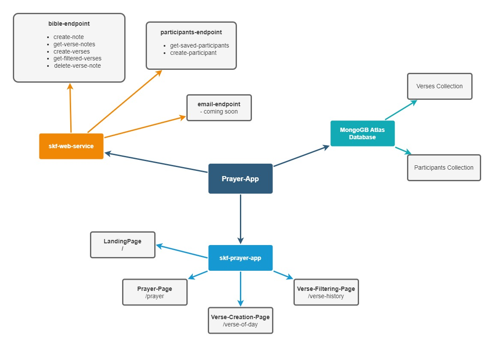

# skf-web-service

### Description
This node service is divided into 3 main endpoints. The bible endpoint is responsible for creation and retrieval of random bible verses and associated notes. The participants endpoint is responsible for creation and retrieval of participants for which the bible verses should be created. The email endpoint is responsible for the email sending. (not implemented yet)

### Diagram of the whole app
 

### Used technology

#### Handling of webserver - Express
#### Handling of mongodb models - Mongoose

### Life version
You will find the life version of this service under [https://skf-web-service.onrender.com](https://skf-web-service.onrender.com/)!

The life version frontend and backend is hosted on render.com. The associated mongodb database is hosted on a mongodb atlas cluster.